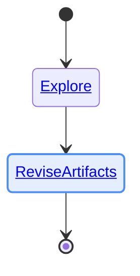

Blue = command · Green = query

```mermaid
stateDiagram-v2
  direction TB

  state "<a href='../exploration/explore.saga.md'>Explore</a>" as Explore
  state "<a href='application/commands/revise-artifacts.use-case.ts'>ReviseArtifacts</a>" as ReviseArtifacts

  [*] --> Explore
  Explore --> ReviseArtifacts
  ReviseArtifacts --> [*]

  classDef command fill:#4C8DF626,stroke:#4C8DF6,stroke-width:2px
  classDef query fill:#009E7326,stroke:#009E73,stroke-width:2px
  class ReviseArtifacts command
```
