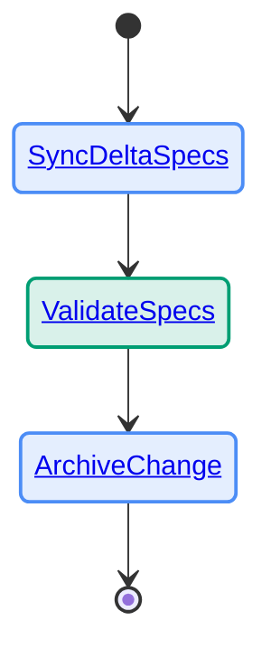

Blue = command · Green = query

```mermaid
stateDiagram-v2
  direction TB

  state "<a href='../specs/application/commands/sync-delta-specs.use-case.ts'>SyncDeltaSpecs</a>" as SyncDeltaSpecs
  state "<a href='../specs/application/queries/validate-specs.use-case.ts'>ValidateSpecs</a>" as ValidateSpecs
  state "<a href='application/commands/archive-change.use-case.ts'>ArchiveChange</a>" as ArchiveChange

  [*] --> SyncDeltaSpecs
  SyncDeltaSpecs --> ValidateSpecs
  ValidateSpecs --> ArchiveChange
  ArchiveChange --> [*]

  classDef command fill:#4C8DF626,stroke:#4C8DF6,stroke-width:2px
  classDef query fill:#009E7326,stroke:#009E73,stroke-width:2px
  class SyncDeltaSpecs,ArchiveChange command
  class ValidateSpecs query
```
