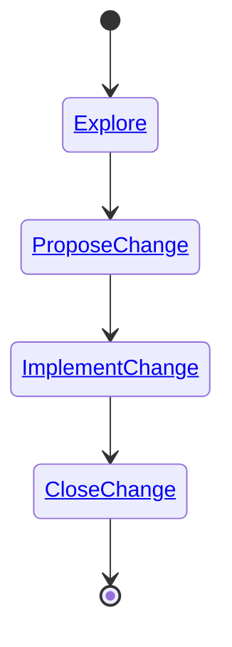

Blue = command · Green = query

```mermaid
stateDiagram-v2
  direction TB

  state "<a href='../exploration/explore.saga.md'>Explore</a>" as Explore
  state "<a href='propose-change.saga.md'>ProposeChange</a>" as ProposeChange
  state "<a href='../implementation/implement-change.saga.md'>ImplementChange</a>" as ImplementChange
  state "<a href='close-change.saga.md'>CloseChange</a>" as CloseChange

  [*] --> Explore
  Explore --> ProposeChange
  ProposeChange --> ImplementChange
  ImplementChange --> CloseChange
  CloseChange --> [*]
```
