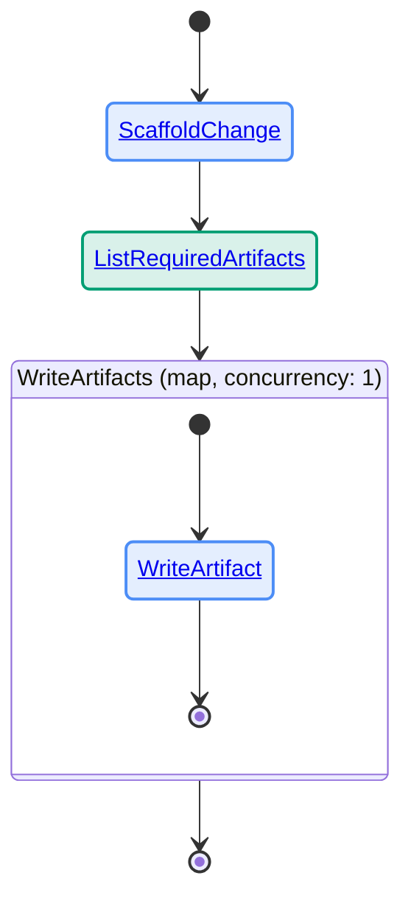

Blue = command · Green = query

```mermaid
stateDiagram-v2
  direction TB

  state "<a href='application/commands/scaffold-change.use-case.ts'>ScaffoldChange</a>" as ScaffoldChange
  state "<a href='application/queries/list-required-artifacts.use-case.ts'>ListRequiredArtifacts</a>" as ListRequiredArtifacts

  [*] --> ScaffoldChange
  ScaffoldChange --> ListRequiredArtifacts
  ListRequiredArtifacts --> WriteArtifacts

  state "WriteArtifacts (map, concurrency: 1)" as WriteArtifacts {
    state "<a href='application/commands/write-artifact.use-case.ts'>WriteArtifact</a>" as WriteArtifact
    [*] --> WriteArtifact
    WriteArtifact --> [*]
  }

  WriteArtifacts --> [*]

  classDef command fill:#4C8DF626,stroke:#4C8DF6,stroke-width:2px
  classDef query fill:#009E7326,stroke:#009E73,stroke-width:2px
  class ScaffoldChange,WriteArtifact command
  class ListRequiredArtifacts query
```
