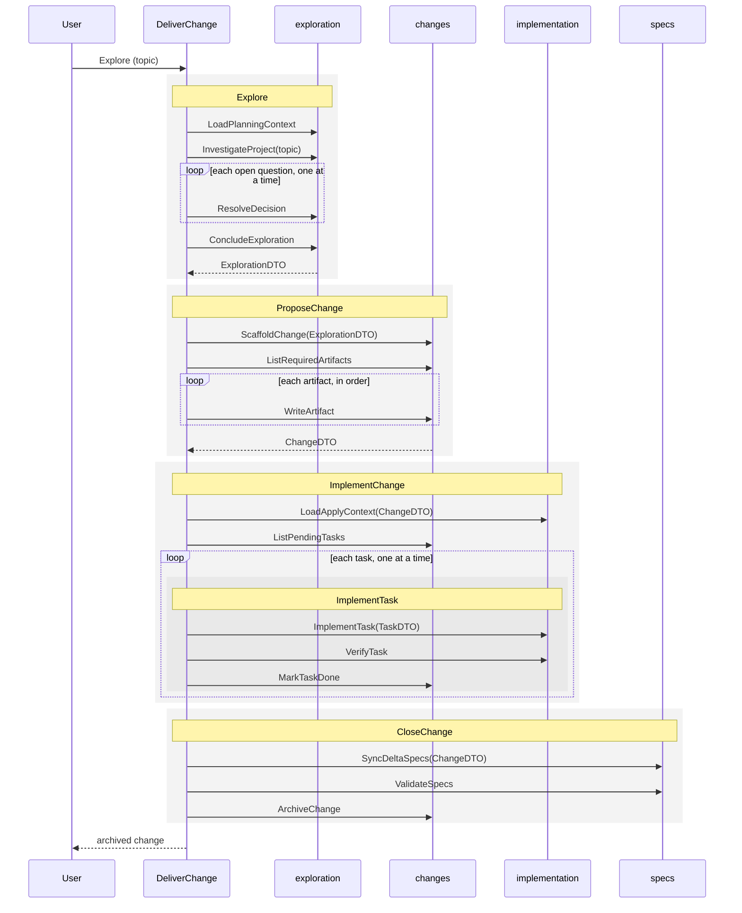

```mermaid
%%{init: {"themeCSS": "rect.actor[name=U]{fill:#9E9E9E26;stroke:#9E9E9E;stroke-width:2px} rect.actor[name=S]{fill:#CC79A726;stroke:#CC79A7;stroke-width:2px} rect.actor[name=E]{fill:#E69F0026;stroke:#E69F00;stroke-width:2px} rect.actor[name=C]{fill:#56B4E926;stroke:#56B4E9;stroke-width:2px} rect.actor[name=I]{fill:#D55E0026;stroke:#D55E00;stroke-width:2px} rect.actor[name=P]{fill:#E3C80026;stroke:#E3C800;stroke-width:2px}"}}%%
sequenceDiagram
    participant U as User
    participant S as DeliverChange
    participant E as exploration
    participant C as changes
    participant I as implementation
    participant P as specs

    U->>S: Explore (topic)

    rect rgba(158, 158, 158, 0.12)
        Note over S,E: Explore
        S->>E: LoadPlanningContext
        S->>E: InvestigateProject(topic)
        loop each open question, one at a time
            S->>E: ResolveDecision
        end
        S->>E: ConcludeExploration
        E-->>S: ExplorationDTO
    end

    rect rgba(158, 158, 158, 0.12)
        Note over S,C: ProposeChange
        S->>C: ScaffoldChange(ExplorationDTO)
        S->>C: ListRequiredArtifacts
        loop each artifact, in order
            S->>C: WriteArtifact
        end
        C-->>S: ChangeDTO
    end

    rect rgba(158, 158, 158, 0.12)
        Note over S,I: ImplementChange
        S->>I: LoadApplyContext(ChangeDTO)
        S->>C: ListPendingTasks
        loop each task, one at a time
            rect rgba(158, 158, 158, 0.12)
                Note over S,I: ImplementTask
                S->>I: ImplementTask(TaskDTO)
                S->>I: VerifyTask
                S->>C: MarkTaskDone
            end
        end
    end

    rect rgba(158, 158, 158, 0.12)
        Note over S,P: CloseChange
        S->>P: SyncDeltaSpecs(ChangeDTO)
        S->>P: ValidateSpecs
        S->>C: ArchiveChange
    end
    S-->>U: archived change
```
