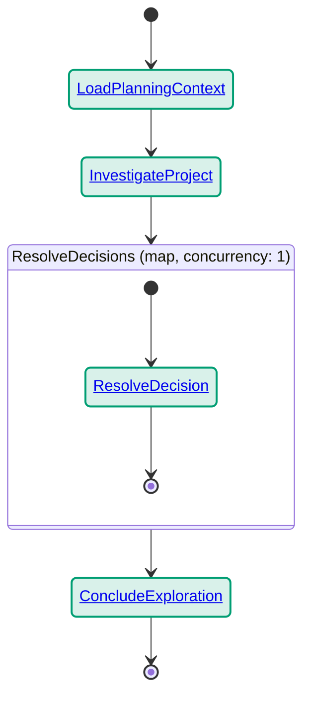

Blue = command · Green = query

```mermaid
stateDiagram-v2
  direction TB

  state "<a href='application/queries/load-planning-context.use-case.ts'>LoadPlanningContext</a>" as LoadPlanningContext
  state "<a href='application/queries/investigate-project.use-case.ts'>InvestigateProject</a>" as InvestigateProject
  state "<a href='application/queries/conclude-exploration.use-case.ts'>ConcludeExploration</a>" as ConcludeExploration

  [*] --> LoadPlanningContext
  LoadPlanningContext --> InvestigateProject
  InvestigateProject --> ResolveDecisions

  state "ResolveDecisions (map, concurrency: 1)" as ResolveDecisions {
    state "<a href='application/queries/resolve-decision.use-case.ts'>ResolveDecision</a>" as ResolveDecision
    [*] --> ResolveDecision
    ResolveDecision --> [*]
  }

  ResolveDecisions --> ConcludeExploration
  ConcludeExploration --> [*]

  classDef command fill:#4C8DF626,stroke:#4C8DF6,stroke-width:2px
  classDef query fill:#009E7326,stroke:#009E73,stroke-width:2px
  class LoadPlanningContext,InvestigateProject,ResolveDecision,ConcludeExploration query
```
