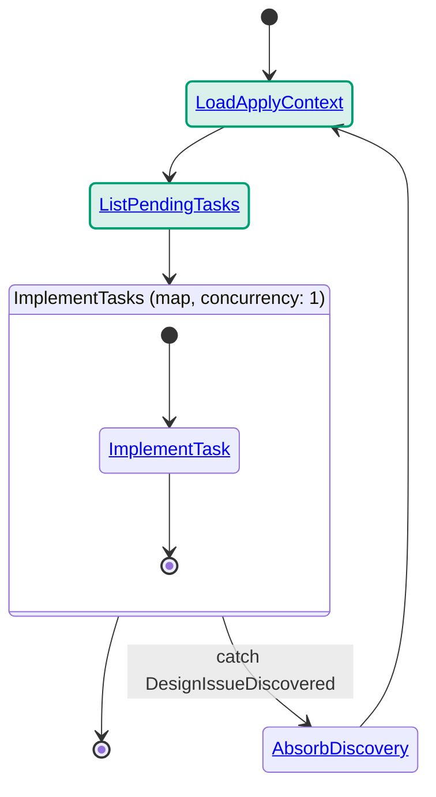

Blue = command · Green = query

```mermaid
stateDiagram-v2
  direction TB

  state "<a href='application/queries/load-apply-context.use-case.ts'>LoadApplyContext</a>" as LoadApplyContext
  state "<a href='../changes/application/queries/list-pending-tasks.use-case.ts'>ListPendingTasks</a>" as ListPendingTasks
  state "<a href='../changes/absorb-discovery.saga.md'>AbsorbDiscovery</a>" as AbsorbDiscovery

  [*] --> LoadApplyContext
  LoadApplyContext --> ListPendingTasks
  ListPendingTasks --> ImplementTasks

  state "ImplementTasks (map, concurrency: 1)" as ImplementTasks {
    state "<a href='implement-task.saga.md'>ImplementTask</a>" as ImplementTask
    [*] --> ImplementTask
    ImplementTask --> [*]
  }

  ImplementTasks --> [*]
  ImplementTasks --> AbsorbDiscovery : catch DesignIssueDiscovered
  AbsorbDiscovery --> LoadApplyContext

  classDef command fill:#4C8DF626,stroke:#4C8DF6,stroke-width:2px
  classDef query fill:#009E7326,stroke:#009E73,stroke-width:2px
  class LoadApplyContext,ListPendingTasks query
```
