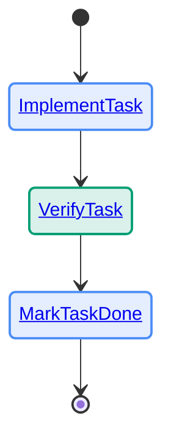

Blue = command · Green = query

```mermaid
stateDiagram-v2
  direction TB

  state "<a href='application/commands/implement-task.use-case.ts'>ImplementTask</a>" as ImplementTask
  state "<a href='application/queries/verify-task.use-case.ts'>VerifyTask</a>" as VerifyTask
  state "<a href='../changes/application/commands/mark-task-done.use-case.ts'>MarkTaskDone</a>" as MarkTaskDone

  [*] --> ImplementTask
  ImplementTask --> VerifyTask
  VerifyTask --> MarkTaskDone
  MarkTaskDone --> [*]

  classDef command fill:#4C8DF626,stroke:#4C8DF6,stroke-width:2px
  classDef query fill:#009E7326,stroke:#009E73,stroke-width:2px
  class ImplementTask,MarkTaskDone command
  class VerifyTask query
```
