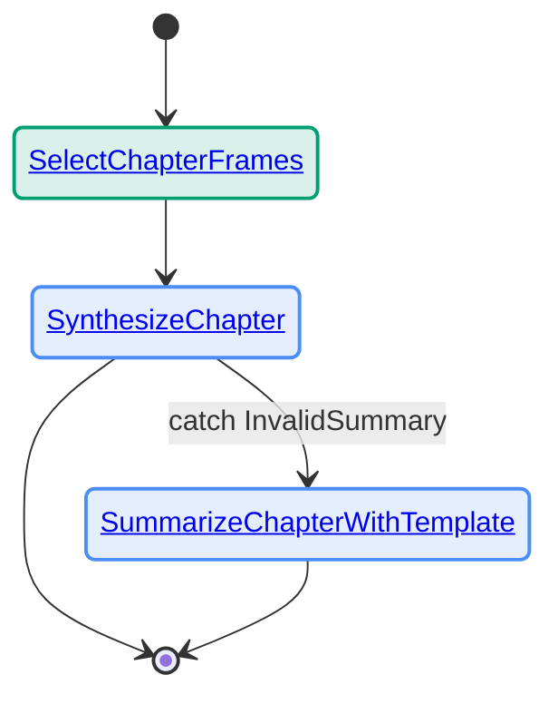

Blue = command · Green = query

```mermaid
stateDiagram-v2
  direction TB

  state "<a href='application/queries/select-chapter-frames.use-case.ts'>SelectChapterFrames</a>" as SelectChapterFrames
  state "<a href='application/commands/synthesize-chapter.use-case.ts'>SynthesizeChapter</a>" as SynthesizeChapter
  state "<a href='application/commands/summarize-chapter-with-template.use-case.ts'>SummarizeChapterWithTemplate</a>" as SummarizeChapterWithTemplate

  [*] --> SelectChapterFrames
  SelectChapterFrames --> SynthesizeChapter
  SynthesizeChapter --> [*]
  SynthesizeChapter --> SummarizeChapterWithTemplate : catch InvalidSummary
  SummarizeChapterWithTemplate --> [*]
  classDef command fill:#4C8DF626,stroke:#4C8DF6,stroke-width:2px
  classDef query fill:#009E7326,stroke:#009E73,stroke-width:2px
  class SynthesizeChapter,SummarizeChapterWithTemplate command
  class SelectChapterFrames query
```
