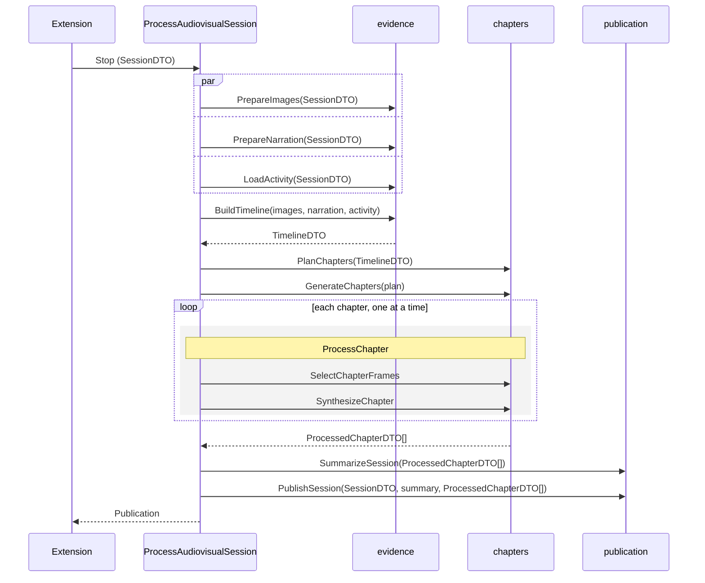

```mermaid
%%{init: {"themeCSS": "rect.actor[name=U]{fill:#9E9E9E26;stroke:#9E9E9E;stroke-width:2px} rect.actor[name=S]{fill:#CC79A726;stroke:#CC79A7;stroke-width:2px} rect.actor[name=E]{fill:#E69F0026;stroke:#E69F00;stroke-width:2px} rect.actor[name=C]{fill:#56B4E926;stroke:#56B4E9;stroke-width:2px} rect.actor[name=P]{fill:#D55E0026;stroke:#D55E00;stroke-width:2px}"}}%%
sequenceDiagram
    participant U as Extension
    participant S as ProcessAudiovisualSession
    participant E as evidence
    participant C as chapters
    participant P as publication

    U->>S: Stop (SessionDTO)

    par
        S->>E: PrepareImages(SessionDTO)
    and
        S->>E: PrepareNarration(SessionDTO)
    and
        S->>E: LoadActivity(SessionDTO)
    end
    S->>E: BuildTimeline(images, narration, activity)
    E-->>S: TimelineDTO

    S->>C: PlanChapters(TimelineDTO)
    S->>C: GenerateChapters(plan)
    loop each chapter, one at a time
        rect rgba(158, 158, 158, 0.12)
            Note over S,C: ProcessChapter
            S->>C: SelectChapterFrames
            S->>C: SynthesizeChapter
        end
    end
    C-->>S: ProcessedChapterDTO[]

    S->>P: SummarizeSession(ProcessedChapterDTO[])
    S->>P: PublishSession(SessionDTO, summary, ProcessedChapterDTO[])
    S-->>U: Publication
```
