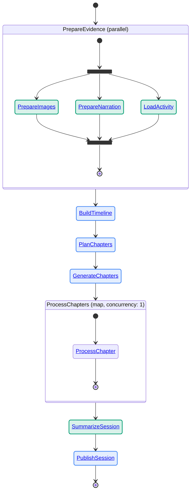

Blue = command · Green = query

```mermaid
stateDiagram-v2
  direction TB

  state "<a href='../evidence/application/commands/build-timeline.use-case.ts'>BuildTimeline</a>" as BuildTimeline
  state "<a href='../chapters/application/commands/plan-chapters.use-case.ts'>PlanChapters</a>" as PlanChapters
  state "<a href='../chapters/application/commands/generate-chapters.use-case.ts'>GenerateChapters</a>" as GenerateChapters
  state "<a href='application/queries/summarize-session.use-case.ts'>SummarizeSession</a>" as SummarizeSession
  state "<a href='application/commands/publish-session.use-case.ts'>PublishSession</a>" as PublishSession

  [*] --> PrepareEvidence

  state "PrepareEvidence (parallel)" as PrepareEvidence {
    state "<a href='../evidence/application/queries/prepare-images.use-case.ts'>PrepareImages</a>" as PrepareImages
    state "<a href='../evidence/application/queries/prepare-narration.use-case.ts'>PrepareNarration</a>" as PrepareNarration
    state "<a href='../evidence/application/queries/load-activity.use-case.ts'>LoadActivity</a>" as LoadActivity
    state Fork <<fork>>
    state Join <<join>>

    [*] --> Fork
    Fork --> PrepareImages
    Fork --> PrepareNarration
    Fork --> LoadActivity
    PrepareImages --> Join
    PrepareNarration --> Join
    LoadActivity --> Join
    Join --> [*]
  }

  PrepareEvidence --> BuildTimeline
  BuildTimeline --> PlanChapters
  PlanChapters --> GenerateChapters
  GenerateChapters --> ProcessChapters

  state "ProcessChapters (map, concurrency: 1)" as ProcessChapters {
    state "<a href='../chapters/process-chapter.saga.md'>ProcessChapter</a>" as ProcessChapter
    [*] --> ProcessChapter
    ProcessChapter --> [*]
  }

  ProcessChapters --> SummarizeSession
  SummarizeSession --> PublishSession
  PublishSession --> [*]
  classDef command fill:#4C8DF626,stroke:#4C8DF6,stroke-width:2px
  classDef query fill:#009E7326,stroke:#009E73,stroke-width:2px
  class BuildTimeline,PlanChapters,GenerateChapters,PublishSession command
  class SummarizeSession,PrepareImages,PrepareNarration,LoadActivity query
```
