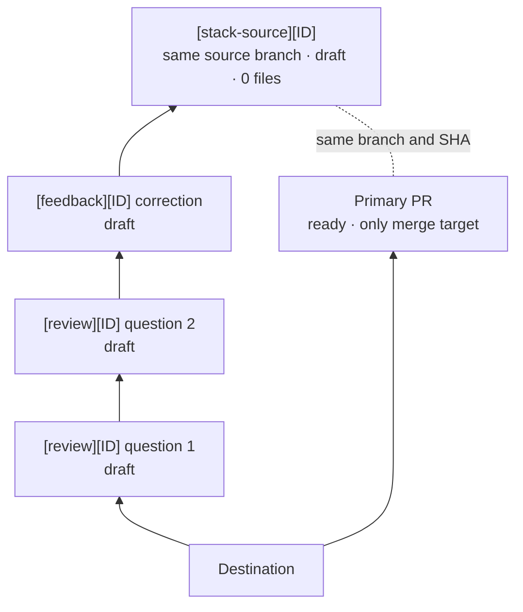

# PR Review

Skill plugin for presenting the same change in two synchronized forms on GitHub:

- one ready primary PR as the only merge unit;
- one all-draft parallel stack divided into reviewable questions.

The plugin is named `pr-review` and exposes three invocations:

- Claude Code: `/pr-review:config`, `/pr-review:start`, `/pr-review:feedback`;
- Codex: `$pr-review:config`, `$pr-review:start`, `$pr-review:feedback`.

You do not need to repeat the contract in the prompt. The skill gets the repository, branch, and PR
from context. Pass an argument only when you need to select another target.

Full walkthrough: [step-by-step tutorial](docs/tutorial.md).

There is no `close` command: closing or merging the primary PR triggers deterministic cleanup through GitHub Actions.

## Install in Codex

```bash
codex plugin marketplace add aquine-kujaruk/skills --ref main
codex plugin add pr-review@aquine-skills
```

Start a new task and run `$pr-review:config` once in each repository. Then use `$pr-review:start`
and `$pr-review:feedback` as needed.

## Install in Claude Code

```text
/plugin marketplace add aquine-kujaruk/skills
/plugin install pr-review@aquine-skills
```

Run `/reload-plugins` if requested. Configure the repository with `/pr-review:config` before using
`/pr-review:start` or `/pr-review:feedback`.

## Visible contract



The primary PR keeps its number, title, body, base, labels, and state. `feedback` only adds commits
to its source branch. The `stack-source` PR is separate because GitHub allows one base per PR. It
shares the primary PR's branch and SHA but uses the last layer as its base to prove equality with
zero changed files.

All auxiliary PRs use one label: `stack-review:managed`. Roles appear in titles. There are no status
labels or feedback rounds.

## 1. Configure the repository

Run once:

```text
$pr-review:config
```

The skill creates or reuses a ready PR to the default branch containing:

- `.github/pr-review.yml`;
- `.github/workflows/pr-review-close.yml`;
- `.github/scripts/pr-review-cleanup.sh`.

Configuration can adapt identifiers, titles, and branches to project conventions. Auxiliary titles
always keep a visible leading tag, by default `[review]`, `[feedback]`, or `[stack-source]`.

`start` and `feedback` remain blocked until that PR is merged, Actions is enabled, and the token has
write access to `contents`, `pull-requests`, and `issues`.

## 2. Publish a review

With the current source branch:

```text
$pr-review:start
```

To select another branch or an existing PR:

```text
$pr-review:start feature/export
$pr-review:start 123
$pr-review:start https://github.com/OWNER/REPO/pull/123
```

The skill:

1. creates or reuses the primary PR without changing its metadata when it already exists;
2. resolves an identifier from the title, branch, or `PR-<number>`;
3. reconstructs the change as coherent questions;
4. publishes marked draft PRs;
5. creates a second PR from the same source branch as the top proof;
6. verifies equal trees and zero changed files;
7. removes all generated internal branches from the local repository.

It returns the primary URL first, followed by the stack from bottom to top, with one question per
layer and evidence of equality.

## 3. Apply feedback

Comment on the primary PR or any layer. If the task already has that PR in context:

```text
$pr-review:feedback
```

You can also pass a number or URL:

```text
$pr-review:feedback 123
$pr-review:feedback https://github.com/OWNER/REPO/pull/123
```

In Claude Code, use the same forms with `/pr-review:…`.

The skill rescans the primary PR and every PR in the active stack. It deduplicates by stable comment
identity, not by round or status. Each draft correction links its source comments, records their
hidden IDs, and replies with the correcting PR and commit. Late comments and new reviewers remain
valid while the stack is open.

Published layers keep their branches, commits, comments, and numbers. New corrections are inserted
immediately below `stack-source`. Local correction branches are removed after publication is
verified.

## Automatic cleanup

When the primary PR is closed or merged, the Action:

1. identifies the generation through hidden markers and the single label;
2. removes native stack membership;
3. closes every auxiliary PR;
4. deletes only remote internal branches created by the plugin;
5. preserves the source branch, primary PR, comments, and closed PRs.

The flow is idempotent and supports manual retry through `workflow_dispatch`. Auxiliary PR close
events do no work. If an unmerged primary PR is reopened after cleanup, `start` creates a new
generation instead of reopening the previous one.

## Local development

`skills/` is the canonical source for Codex and Claude Code. Versioned links under `.agents/skills/`
expose the three skills within this project. The manifests only package the same content.

Validation:

```bash
python3 skills/config/scripts/validate.py
git diff --check
claude plugin validate .
```

The official `github/gh-stack` extension still depends on the Stacked PRs public preview. Remote
operations are not atomic, so the skills inspect GitHub before retrying.

## Official references

- [GitHub: Stacked pull requests](https://docs.github.com/en/pull-requests/how-tos/stacked-pull-requests)
- [GitHub: Stacked PR CLI commands](https://docs.github.com/en/pull-requests/reference/stacked-prs-cli-commands)
- [GitHub Actions: `pull_request_target`](https://docs.github.com/en/actions/reference/workflows-and-actions/events-that-trigger-workflows#pull_request_target)
- [Claude Code: plugins](https://code.claude.com/docs/en/plugins)
