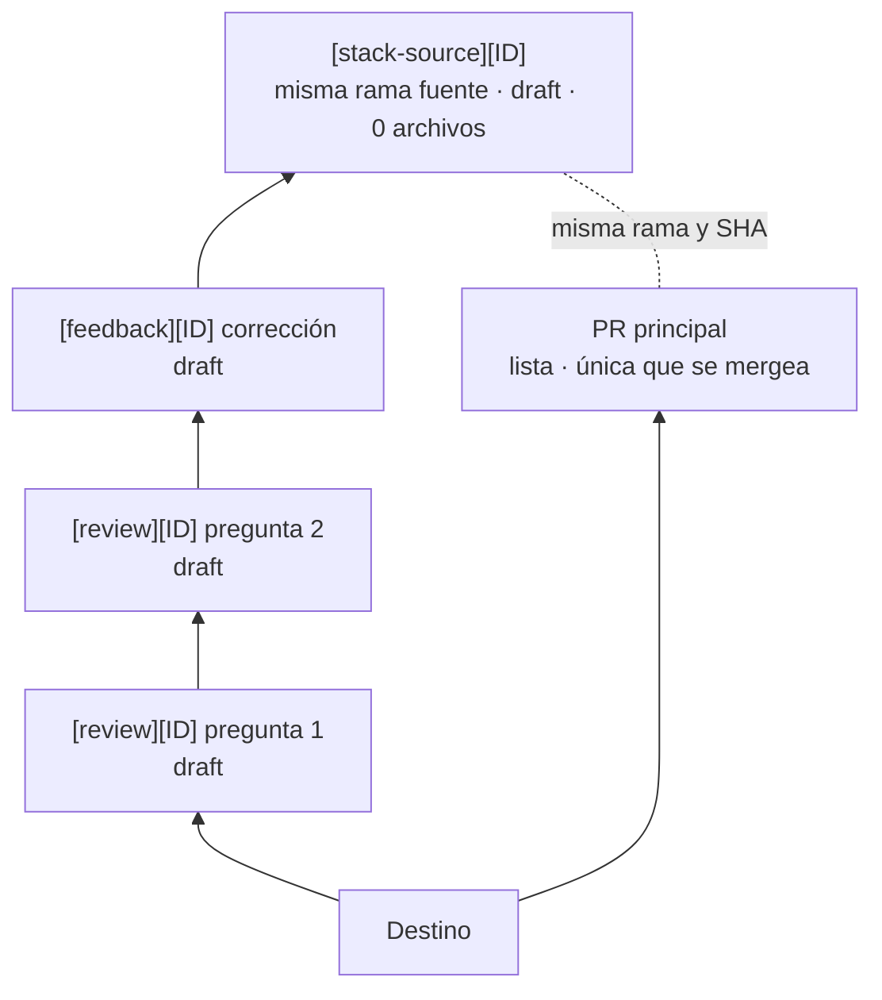

# PR Review

Plugin de skills para presentar un mismo cambio de dos formas sincronizadas en GitHub:

- una PR principal, lista y única unidad de merge;
- un stack paralelo completamente draft, dividido en preguntas revisables.

El plugin se llama `pr-review` y expone tres invocaciones:

- Claude Code: `/pr-review:config`, `/pr-review:start`, `/pr-review:feedback`;
- Codex: `$pr-review:config`, `$pr-review:start`, `$pr-review:feedback`.

No hace falta repetir el contrato en el prompt. La skill obtiene repositorio, rama y PR del contexto; pasa un argumento solo cuando quieras señalar otro objetivo.

Recorrido completo: [tutorial paso a paso](docs/tutorial.md).

No existe `close`: el cierre o merge de la PR principal activa una limpieza determinista mediante GitHub Actions.

## Instalar en Codex

```bash
codex plugin marketplace add aquine-kujaruk/skills --ref main
codex plugin add pr-review@aquine-skills
```

Abre una tarea nueva y ejecuta `$pr-review:config` una vez en cada repositorio. Después usa
`$pr-review:start` y `$pr-review:feedback` cuando corresponda.

## Instalar en Claude Code

```text
/plugin marketplace add aquine-kujaruk/skills
/plugin install pr-review@aquine-skills
```

Ejecuta `/reload-plugins` si se solicita. Configura el repositorio con `/pr-review:config` antes de
usar `/pr-review:start` o `/pr-review:feedback`.

## Contrato visible



La PR principal conserva su número, título, body, base, labels y estado. `feedback` solo añade commits a su rama fuente. La PR `stack-source` es distinta porque GitHub permite una sola base por PR; comparte la rama y SHA de la principal, pero usa la última capa como base para demostrar igualdad con cero archivos cambiados.

Todas las PR auxiliares usan un único label, `stack-review:managed`. Los roles están en los títulos. No hay labels de estado ni rondas de feedback.

## 1. Configurar el repositorio

Ejecuta una vez:

```text
$pr-review:config
```

La skill crea o reutiliza una PR lista hacia la rama por defecto con:

- `.github/pr-review.yml`;
- `.github/workflows/pr-review-close.yml`;
- `.github/scripts/pr-review-cleanup.sh`.

La configuración permite adaptar identificadores, títulos y ramas a las convenciones del proyecto. Los títulos auxiliares siempre conservan una etiqueta inicial visible, por defecto `[review]`, `[feedback]` o `[stack-source]`.

`start` y `feedback` quedan bloqueadas hasta que esa PR esté mergeada, Actions esté habilitado y el token tenga `contents`, `pull-requests` e `issues` con escritura.

## 2. Publicar una revisión

Con la rama fuente actual:

```text
$pr-review:start
```

Para señalar otra rama o una PR ya publicada:

```text
$pr-review:start feature/export
$pr-review:start 123
$pr-review:start https://github.com/OWNER/REPO/pull/123
```

La skill:

1. crea o reutiliza la PR principal sin modificar sus metadatos si ya existe;
2. resuelve un identificador desde el título, la rama o `PR-<número>`;
3. reconstruye el cambio en preguntas coherentes;
4. publica PRs draft marcadas;
5. crea una segunda PR desde la misma rama fuente como prueba superior;
6. verifica árboles iguales y cero archivos cambiados;
7. elimina del local todas las ramas internas generadas.

Devuelve primero la URL principal y después el stack de abajo arriba, con una pregunta por capa y evidencia de igualdad.

## 3. Aplicar feedback

Comenta en la PR principal o en cualquier capa. Si la tarea ya tiene esa PR en contexto:

```text
$pr-review:feedback
```

También puedes pasar número o URL:

```text
$pr-review:feedback 123
$pr-review:feedback https://github.com/OWNER/REPO/pull/123
```

En Claude Code usa las mismas formas con `/pr-review:…`.

La skill vuelve a escanear la PR principal y todas las PR del stack activo. Deduplica por identidad estable del comentario, no por ronda ni estado. Cada corrección draft enlaza los comentarios fuente, registra sus IDs ocultos y responde con la PR y el commit correctores. Comentarios tardíos y revisores nuevos siguen siendo válidos mientras el stack esté abierto.

Las capas publicadas conservan ramas, commits, comentarios y números. Las nuevas correcciones se insertan inmediatamente debajo de `stack-source`. Las ramas locales de corrección desaparecen tras verificar la publicación.

## Cierre automático

Al cerrar o mergear la PR principal, la Action:

1. identifica la generación por markers ocultos y el único label;
2. elimina su pertenencia al stack nativo;
3. cierra todas las PR auxiliares;
4. borra solo las ramas remotas internas creadas por el plugin;
5. conserva la rama fuente, la PR principal, comentarios y PRs cerradas.

El flujo es idempotente y admite reintento manual con `workflow_dispatch`. Los eventos de cierre de PRs auxiliares no hacen trabajo. Si se reabre una principal no mergeada después del cleanup, `start` crea una generación nueva; no reabre la anterior.

## Desarrollo local

`skills/` es la fuente canónica para Codex y Claude Code. Los enlaces versionados de `.agents/skills/` exponen las tres skills dentro de este proyecto. Los manifests solo empaquetan el mismo contenido.

Validación:

```bash
python3 skills/config/scripts/validate.py
git diff --check
claude plugin validate .
```

La extensión oficial `github/gh-stack` sigue dependiendo de la public preview de Stacked PRs. Las operaciones remotas no son atómicas; las skills inspeccionan GitHub antes de reintentar.

## Referencias oficiales

- [GitHub: Stacked pull requests](https://docs.github.com/en/pull-requests/how-tos/stacked-pull-requests)
- [GitHub: Stacked PR CLI commands](https://docs.github.com/en/pull-requests/reference/stacked-prs-cli-commands)
- [GitHub Actions: `pull_request_target`](https://docs.github.com/en/actions/reference/workflows-and-actions/events-that-trigger-workflows#pull_request_target)
- [Claude Code: plugins](https://code.claude.com/docs/en/plugins)
