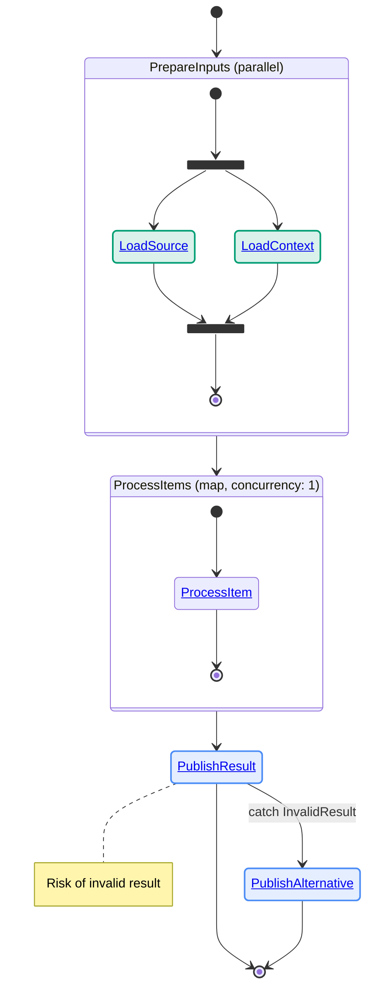
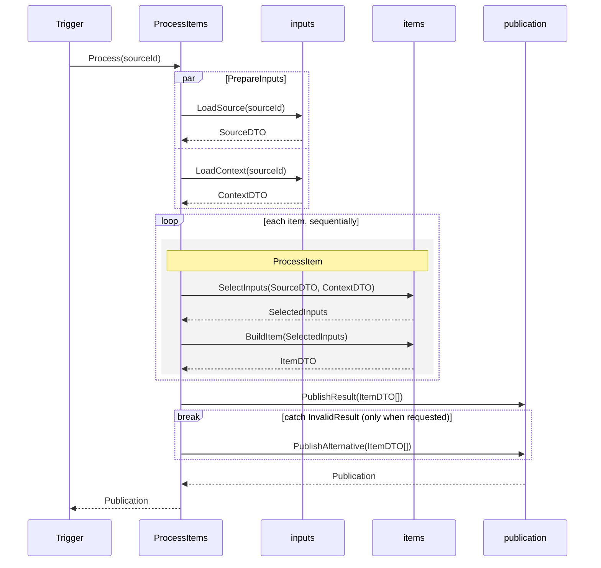

# Diagram notation

Adapt names and relative links to the package. Each saga file starts with
`Blue = command · Green = query` and contains one state diagram. Step labels
omit role suffixes; containers and sub-sagas stay neutral. The catch and note
below illustrate requested failure handling: omit that diversion on a happy-path turn.
Use the code's concurrency; `1` here means sequential business units.

The sequence unfolds sub-sagas rather than adding saga participants. Add one
actor-box CSS rule per lane, retaining a different translucent tint and solid
border for each. A requested catch uses `break`; ordinary publication failure
has no diversion. Declare any caught error in its raising context's domain.

